# TransitFlow Database Design Document

Team ID: Team30

Repository: https://github.com/yicheng31/DBMS-demo

## Section 1 - Entity-Relationship Diagram

The relational database stores user accounts, metro services, national rail services, ticketing transactions, payments, feedback, and policy documents for RAG search. The design separates static transport data from transactional data so availability, fare, booking, and user-history queries can be expressed with clear joins.

```mermaid
erDiagram
    registered_users ||--|| user_auth_credentials : has
    registered_users ||--o{ national_rail_bookings : makes
    registered_users ||--o{ metro_trips : takes
    registered_users ||--o{ feedback : writes

    metro_stations ||--o{ metro_station_lines : serves
    metro_stations ||--o{ metro_interchange_lines : interchanges_on
    metro_stations ||--o{ metro_schedule_stops : appears_in
    metro_stations ||--o{ station_interchanges : connects_to_rail

    national_rail_stations ||--o{ national_rail_station_lines : serves
    national_rail_stations ||--o{ national_rail_interchange_lines : interchanges_on
    national_rail_stations ||--o{ national_rail_schedule_stops : appears_in
    national_rail_stations ||--o{ station_interchanges : connects_to_metro

    metro_schedules ||--o{ metro_schedule_stops : has_ordered_stops
    metro_schedules ||--o{ metro_schedule_operating_days : operates_on
    metro_schedules ||--o{ metro_trips : records

    national_rail_schedules ||--o{ national_rail_schedule_stops : has_ordered_stops
    national_rail_schedules ||--o{ national_rail_schedule_operating_days : operates_on
    national_rail_schedules ||--o{ national_rail_fares : prices
    national_rail_schedules ||--o{ national_rail_seats : contains
    national_rail_schedules ||--o{ national_rail_bookings : records

    national_rail_seats ||--o{ national_rail_bookings : assigned_to
    national_rail_bookings ||--o| payments : paid_by
    metro_trips ||--o| payments : paid_by
    national_rail_bookings ||--o| feedback : reviewed_by
    metro_trips ||--o| feedback : reviewed_by
```

Key entities and representative attributes:

| Entity | Primary key | Important foreign keys | Representative attributes |
|---|---|---|---|
| `registered_users` | `id` | none | `user_id`, `email`, `first_name`, `surname`, `is_active` |
| `user_auth_credentials` | `user_pk` | `user_pk -> registered_users.id` | `password_hash`, `secret_question`, `secret_answer` |
| `metro_stations` | `id` | none | `station_id`, `name`, `is_interchange_metro`, `is_interchange_national_rail` |
| `national_rail_stations` | `id` | none | `station_id`, `name`, `is_interchange_national_rail`, `is_interchange_metro` |
| `metro_schedules` | `id` | `origin_station_pk`, `destination_station_pk` | `schedule_id`, `line`, `direction`, `base_fare_usd`, `frequency_min` |
| `national_rail_schedules` | `id` | `origin_station_pk`, `destination_station_pk` | `schedule_id`, `line`, `service_type`, `frequency_min` |
| `metro_schedule_stops` | `(metro_schedule_pk, stop_sequence)` | `metro_schedule_pk`, `metro_station_pk` | `stop_sequence`, `travel_time_from_origin_min` |
| `national_rail_schedule_stops` | `(national_rail_schedule_pk, stop_sequence)` | `national_rail_schedule_pk`, `national_rail_station_pk` | `stop_sequence`, `travel_time_from_origin_min` |
| `national_rail_fares` | `(national_rail_schedule_pk, fare_class)` | `national_rail_schedule_pk` | `base_fare_usd`, `per_stop_rate_usd` |
| `national_rail_seats` | `id` | `national_rail_schedule_pk` | `seat_id`, `coach`, `fare_class`, `row_number`, `seat_column` |
| `national_rail_bookings` | `id` | `user_pk`, `national_rail_schedule_pk`, `national_rail_seat_pk` | `booking_id`, `travel_date`, `amount_usd`, `status` |
| `metro_trips` | `id` | `user_pk`, `metro_schedule_pk` | `trip_id`, `travel_date`, `ticket_type`, `amount_usd`, `status` |
| `payments` | `id` | `national_rail_booking_pk` or `metro_trip_pk` | `payment_id`, `amount_usd`, `method`, `status` |
| `feedback` | `id` | `user_pk`, booking/trip FK | `feedback_id`, `rating`, `comment`, `submitted_at` |
| `policy_documents` | `id` | none | `title`, `category`, `content`, `embedding` |

Major cardinalities:

| Relationship | Cardinality | Rationale |
|---|---|---|
| User to auth credentials | 1:1 | Each active account has exactly one password/secret-answer record. |
| User to rail bookings | 1:N | A user can make many bookings; each booking belongs to one user. |
| User to metro trips | 1:N | A user can have many metro trip records. |
| Schedule to ordered stops | 1:N | A schedule has multiple ordered stops; each stop row belongs to one schedule. |
| Schedule to seats | 1:N | A national rail schedule has many bookable seats. |
| Booking/trip to payment | 1:0..1 | A transaction can have one payment record; the payment is linked to either a booking or a metro trip. |
| Metro station to rail station interchange | M:N | A station pair is represented through `station_interchanges`. |

## Section 2 - Normalisation Justification

The schema follows 3NF for the main transit and transaction data. Station, schedule, ordered stop, fare, seat, user, payment, and feedback data are separated so non-key attributes depend on the key of their own table rather than on another non-key attribute.

The clearest 3NF decision is the use of `metro_schedule_stops` and `national_rail_schedule_stops` instead of storing stop lists as array or text columns inside the schedule tables. The functional dependency is:

`(schedule_pk, stop_sequence) -> station_pk, travel_time_from_origin_min`

This means each stop position has its own station and travel-time value. Keeping this in a junction table lets queries compare origin and destination stop order directly, which is required by `query_metro_schedules()` and `query_national_rail_availability()`. If stop IDs were stored as an array, the system would need extra parsing logic and would be weaker for constraints, indexing, and joins.

Line membership is also normalized into `metro_station_lines`, `metro_interchange_lines`, `national_rail_station_lines`, and `national_rail_interchange_lines`. A station can serve multiple lines, and storing line values as repeated rows avoids multi-valued attributes in station tables.

The main deliberate de-normalisation is keeping fare and amount snapshots in transaction rows such as `national_rail_bookings.amount_usd` and `metro_trips.amount_usd`. Although fares can be calculated from fare tables or schedule rows, the actual amount paid should be preserved at purchase time. This prevents historical bookings from changing if future fare rules are updated.

Passwords are not stored as plain text. The relational query layer uses Argon2 through `argon2.PasswordHasher`. Argon2 is preferred over MD5 or SHA-style hashing because it is an adaptive password hashing algorithm with configurable computational cost, making brute-force attacks harder. Salt is generated as part of the Argon2 hash format, so two users with the same password will not have the same stored hash. This prevents simple rainbow-table lookup attacks.

The schema uses internal `BIGINT GENERATED ALWAYS AS IDENTITY` primary keys and keeps mock-data IDs such as `RU01`, `MS01`, `NR_SCH01`, `BK001`, and `PM001` as unique external codes. The internal keys make joins compact and stable, while external codes remain suitable for UI, agent tools, and seed data.

The delete strategy is mostly soft-delete or status-based retention. Users have `is_active`, and bookings/trips retain records with statuses such as `confirmed`, `completed`, and `cancelled`. This keeps payment, feedback, and travel history auditable. For seat availability, a partial unique index prevents the same seat from being actively booked twice while allowing cancelled bookings to remain in history.

## Section 3 - Graph Database Design Rationale

Neo4j stores the physical transport network as a graph. Stations are nodes, direct travel links are relationships, and routing metrics are relationship properties.

Node labels:

| Label | Purpose | Main properties |
|---|---|---|
| `Station` | Shared base label for all route queries | `station_id`, `name`, `network`, `lines` |
| `MetroStation` | City metro station nodes | `station_id`, `name`, `lines`, interchange fields |
| `NationalRailStation` | National rail station nodes | `station_id`, `name`, `lines`, interchange fields |

Relationship types:

| Relationship | Connects | Properties | Rationale |
|---|---|---|---|
| `METRO_LINK` | metro station to adjacent metro station | `line`, `travel_time_min`, `fare_standard_usd`, `fare_first_usd` | Represents direct metro movement. |
| `RAIL_LINK` | rail station to adjacent rail station | `line`, `travel_time_min`, `fare_standard_usd`, `fare_first_usd` | Represents direct national rail movement. |
| `INTERCHANGE_TO` | metro station to paired rail station, both directions | `line`, `travel_time_min`, fare properties | Represents walking/transfer time between networks. |

The graph database is better than a relational table for routing because route queries are naturally graph traversals. Shortest-route and cheapest-route queries need repeated expansion from one station to neighbouring stations while accumulating edge weights. In SQL this would require recursive CTEs with path arrays, cycle checks, cost accumulation, and stop conditions. In the graph layer, the network is already stored as nodes and edges, so Dijkstra-style traversal directly follows the data model.

The implementation uses an in-memory Dijkstra-style traversal over data loaded from Neo4j. This avoids depending on APOC plugins, so the project can run on the default Neo4j container. The algorithm uses a heap priority queue where the priority is either total travel time or total estimated fare.

Two important query types are:

| Query type | Function | How the graph enables it |
|---|---|---|
| Fastest route | `query_shortest_route()` | Traverses `METRO_LINK`, `RAIL_LINK`, and sometimes `INTERCHANGE_TO`, minimizing `travel_time_min`. |
| Cheapest route | `query_cheapest_route()` | Uses the same graph structure but changes the edge weight to `fare_standard_usd` or `fare_first_usd`. |
| Interchange path | `query_interchange_path()` | Allows cross-network traversal through `INTERCHANGE_TO` edges. |
| Delay ripple | `query_delay_ripple()` | Performs bounded hop expansion from a delayed station and reports affected stations with `hops_away`. |
| Alternative routes | `query_alternative_routes()` | Searches paths while excluding an avoided station. |

Node identity is `station_id`, such as `MS01` or `NR05`. This is used because the mock data, UI, agent tools, and relational data all use those station codes. The graph seed script creates a uniqueness constraint on `Station.station_id`.

## Section 4 - Vector / RAG Design

The RAG component embeds policy documents such as refund rules, booking rules, ticket types, travel policies, and conduct information. These documents are stored in the PostgreSQL `policy_documents` table with a vector column.

The search pipeline is:

1. The user asks a policy-related question.
2. The LLM provider creates an embedding for the query.
3. PostgreSQL pgvector compares the query vector against `policy_documents.embedding`.
4. The system retrieves the top matching policy documents using cosine distance.
5. Retrieved policy content is inserted into the LLM prompt.
6. The assistant answers using the retrieved policy evidence.

Cosine similarity is appropriate because policy search is semantic rather than exact keyword search. It compares vector direction, so documents can match even when the user uses different wording from the original policy text. This is useful for questions such as "Can I bring luggage?" or "What happens if the train is delayed?"

The current schema uses `vector(3072)` for Gemini `gemini-embedding-001`, matching `.env.example` and the schema comments. The code also documents Ollama `nomic-embed-text` as a 768-dimensional alternative. If the provider is changed after seeding, existing stored embeddings would have a different dimension from new query embeddings. In that case the vector table/schema should be reset to the matching dimension and policy documents re-seeded with the new provider.

## Section 5 - AI Tool Usage Evidence

### Example 1 - Relational schema and query design

Context: The team needed a normalized relational schema and query functions for metro schedules, national rail availability, fare calculation, booking, cancellation, and authentication.

Prompt: We asked an AI assistant to compare the mock JSON files with the required query function signatures and propose table structures and SQL join patterns.

Outcome: The team implemented `databases/relational/schema.sql`, `databases/relational/queries.py`, and `skeleton/seed_postgres.py`. The commit history shows Yicheng's main relational work in commit `87ccc9b` plus later fare and availability corrections in `1c736f3` and `2c57fad`.

### Example 2 - Graph route implementation

Context: The graph query stubs needed route search, cheapest route, alternative route, interchange path, delay ripple, and station connection behavior.

Prompt: We asked AI to help design a Neo4j station graph and route-query functions based on `metro_stations.json` and `national_rail_stations.json`.

Outcome: Fongyi implemented station seeding and graph queries in commits such as `7c24106`, `2b11d8d`, `51dc5d8`, `9206cd8`, and `0e3969c`. PR #5 further refined route return shape and delay-ripple edge cases.

### Example 3 - UI and agent extension

Context: The base application needed a friendlier interface, better handling of Chinese user queries, and more reliable tool selection for the LLM agent.

Prompt: We asked AI to improve TransitFlow's Gradio UI and agent routing while still using the existing database functions, and to identify why the small LLM (llama3.2:1b) was selecting wrong tools for Chinese queries.

Outcome: Yuhao's PR #3 and subsequent commits redesigned the agent architecture from LLM-dependent tool selection to a deterministic pre-classification system. The system categorizes each query into one of 12 categories using keyword detection before any LLM call, then routes directly to the correct database tool or tool chain. This improved correct tool selection from approximately 40% to 95% on Chinese queries. The extension also added Chinese UI localization, station quick-select buttons, Chinese station-name support (30 mappings), Chinese policy-query translation for pgvector cross-language search (15 entries), four new agent tools (`get_user_profile`, `get_payment_info`, `get_national_rail_schedule_fares`, `get_station_connections`), a multi-step booking chain (availability → fare → seats in one turn), booking context recovery across conversation turns, and a booking confirmation gate.

### Example 4 - Debugging wrong or incomplete AI output

Context: Some generated code initially made assumptions that did not match the rubric or runtime environment, such as relying on APOC for Neo4j routing or returning alternative routes in a shape that the UI could not display well. Several agent bugs were also identified during testing, including station ID deduplication, hops=0 being treated as falsy, and cross-network alternative routes returning empty results due to incorrect network parameter.

Prompt: We asked AI to review the code against the assignment rubric and the actual runtime environment, and to identify the root cause of each failing test case.

Outcome: The graph implementation was adjusted to use an in-memory Dijkstra-style traversal instead of APOC. PR #5 improved route objects and delay handling; PR #6 continued improving physical interchange handling and readability. Seven agent bugs were identified and resolved: station ID deduplication, schedule ID recovery ordering, fare class extraction from user messages only, continuation dialog detection, hops=0 falsy fix, avoid-keyword routing to `find_alternative_routes`, and cross-network queries forcing `network="auto"`. This is an example where AI output required human review and correction.

### Example 5 - Codespaces and integration fixes

Context: After feature work, the project still needed to run in Codespaces and connect to PostgreSQL, Neo4j, and vector seed scripts reliably.

Prompt: We asked AI to identify path/import/config problems from runtime errors.

Outcome: Yicheng committed Codespaces and integration fixes in `565b93a`, `ef0a976`, and `a4f1651`, touching `skeleton/agent.py`, `skeleton/ui.py`, `skeleton/config.py`, `skeleton/seed_neo4j.py`, and `skeleton/seed_vectors.py`.

## Section 6 - Reflection & Trade-offs

One major design decision was to use internal numeric primary keys while keeping external mock IDs as unique codes. This made joins efficient and stable, while still allowing the agent and UI to use readable IDs such as `MS01`, `NR01`, and `BK001`.

A second design decision was to keep route-planning logic in Neo4j rather than in PostgreSQL. While the relational database is stronger for bookings, fares, and user history, routing is fundamentally about traversing connected stations. Keeping this in the graph layer made shortest-path, cheapest-path, interchange, and disruption queries easier to reason about.

Another trade-off was the in-memory Dijkstra-style traversal. APOC Dijkstra would be more database-native, but using a Python heap traversal avoids extra plugin setup and makes the project easier to run in a course Docker/Codespaces environment.

In a production system, we would improve connection management and migrations. The current project opens direct database connections inside query functions, which is acceptable for coursework. A production version should use connection pooling, migration tooling such as Alembic or Flyway, secret management for credentials, automated tests, and stronger observability for failed bookings and payment transactions.

## Section 7 - Optional Extension

The optional extension was primarily implemented through PR #3 and subsequent commits by Yuhao, and focused on redesigning the agent architecture and improving the UI experience.

### Motivation

The original interface was English-first and relied entirely on the LLM to select the correct database tool from 14 options. Testing revealed that the small model (llama3.2:1b, 1.3B parameters) selected the wrong tool in over 60% of Chinese queries, failed to chain multiple tools for multi-step queries such as booking, and could not recover booking context across conversation turns. The extension addresses these problems with deterministic preprocessing and a multi-step chaining system.

### Changes

| Area | Change |
|---|---|
| Agent architecture | Replaced LLM-dependent tool selection (14 tools, ~40% accuracy on Chinese queries) with a deterministic pre-classification system (12 categories, ~95% accuracy). Each query is categorized by keyword detection before any LLM call, then routed directly to the correct tool or tool chain. |
| Multi-step booking chain | Booking queries automatically call availability → fare (per schedule) → seats in one turn. Previously the LLM had to call these tools sequentially, which it frequently failed to do. |
| Booking confirmation | Added `_is_confirmation()` early gate that detects confirmation messages on the raw user input, and `_recover_booking_context()` that reconstructs schedule ID, station IDs, travel date, and fare class from conversation history so `make_booking` can execute correctly. |
| Bug fixes | Resolved 7 documented bugs: station ID deduplication in injected text, schedule ID recovery search order, fare class extracted from user messages only (not AI responses), continuation dialog detection from history, hops=0 falsy fix, avoid-keyword routing to `find_alternative_routes`, cross-network queries forcing `network="auto"`. |
| Agent tools | Added routing for `get_user_profile`, `get_payment_info`, `get_national_rail_schedule_fares`, and `get_station_connections`, exposing existing PostgreSQL and Neo4j query functions that were previously unreachable through the agent. |
| Chinese station support | Added 30 Chinese station name mappings to the station index so Chinese station names are resolved to IDs before any tool call. |
| Policy search | Added 15-entry Chinese policy keyword translation dictionary. Chinese policy queries are translated to English before embedding, enabling cross-language vector search against English policy documents in pgvector. |
| UI | Added Chinese localization, welcome message, quick-select station buttons, login panel auto-close, and friendlier authentication messages. |

### Example queries

| User query | Expected behavior |
|---|---|
| `NR01到NR05有哪些班次？` | Pre-classified as `availability`, calls `check_national_rail_availability`. |
| `MS01到MS09有哪些捷運？` | Pre-classified as `availability`, calls `check_metro_availability`. |
| `從MS01到MS14最快怎麼走？` | Pre-classified as `route`, calls `find_route(optimise_by=time)`. |
| `退款政策是什麼？` | Pre-classified as `policy`, translates keyword to English, calls `query_policy_vector_search`. |
| `你好` | Detected as greeting before pre-classification, skips all tool calls. |
| `幫我訂 NR01 到 NR05 standard ticket 2026-06-15` | Pre-classified as `booking`, chains availability → fare → seats, shows summary and asks to confirm. |
| `確認` | Detected as confirmation, recovers booking context from history, calls `make_booking`. |
| `MS15 hops=0` | Pre-classified as `delay`, extracts hops=0 with explicit None check, returns only MS15. |
| `MS01 到 NR10 avoid MS07` | Pre-classified as `route`, detects avoid keyword, calls `find_alternative_routes(network=auto)`. |

### Testing evidence

All 9 example queries above were manually verified. The booking flow was end-to-end tested: query → availability/fare/seats chain → confirmation → `make_booking` → booking ID returned (e.g. BK-PJTJCT). The 7 bug fixes were each verified against the specific failing test case that exposed them, as documented in TASK6.md.
